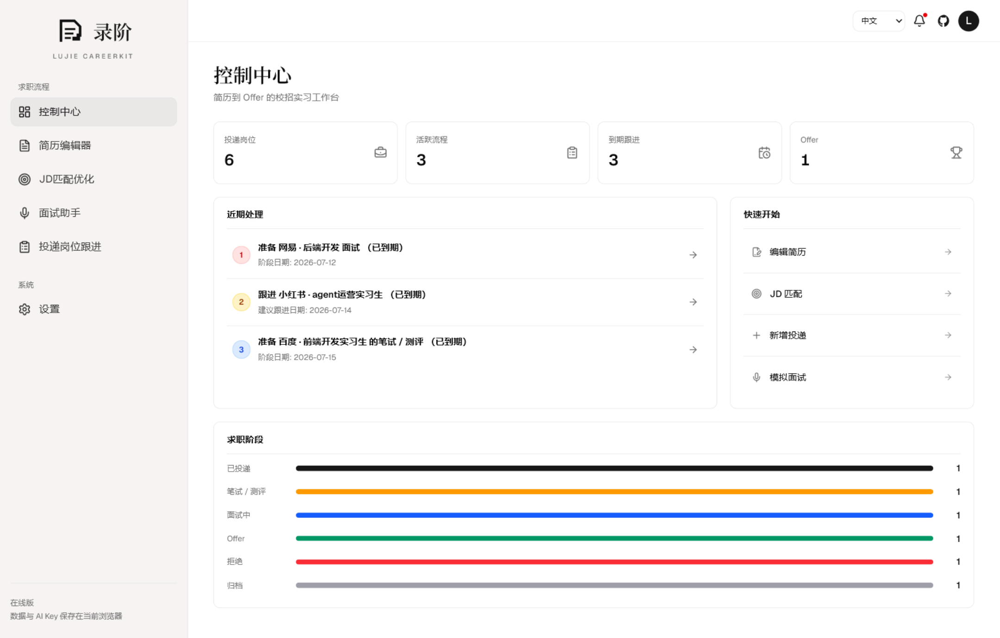
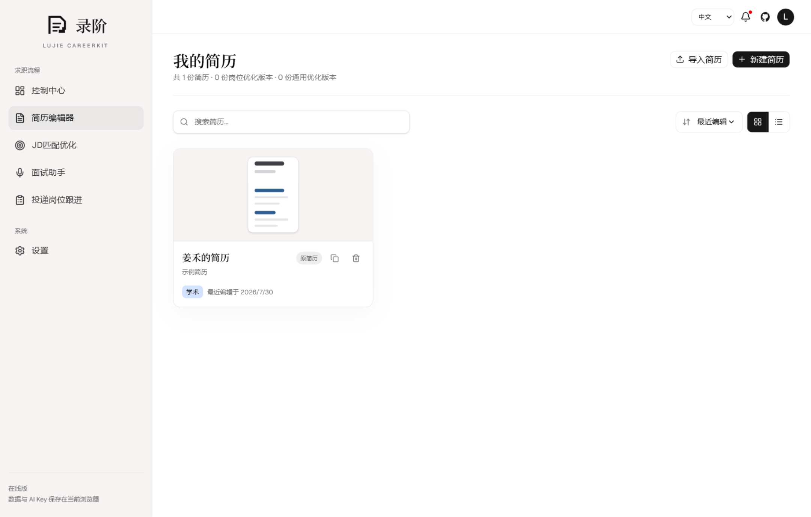
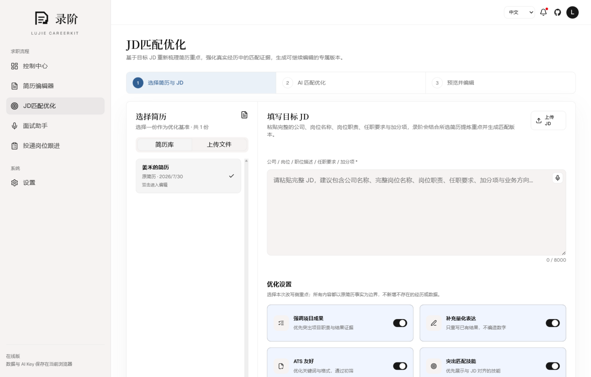

<p align="center">
  
</p>

<h1 align="center">录阶 / LuJie CareerKit</h1>

<p align="center">
  <strong>帮助你从简历编辑到 Offer 录用的 AI 驱动求职工作台，覆盖简历编辑、JD 匹配、投递跟进、模拟面试和复盘。</strong>
</p>
<p align="center">
  <a href="README.md">English</a> · 简体中文
</p>

<p align="center">
  
  
  
  
  
  
</p>

<p align="center">
  
</p>

## 项目简介

录阶面向实习、校招和职业求职场景，把简历编辑、岗位匹配、投递管理、面试准备、模拟练习和 AI 复盘放在同一个 Agent 驱动的求职工作台里。你可以围绕不同岗位维护多份简历版本，根据岗位描述生成更贴合岗位要求的简历表达与专属面试准备资料，记录每一次投递进展，并在面试前后持续沉淀知识、回答、反馈和复盘材料。

## 在线预览

访问 [https://lujie.chozzc.dev](https://lujie.chozzc.dev) 体验在线预览。

## 界面预览

| **控制中心** | **简历库** |
| --- | --- |
|  |  |
| **简历编辑器** | **JD 匹配优化** |
|  |  |
| **JD 匹配优化简历** | **面试助手** |
|  |  |
| **模拟面试** | **AI 复盘** |
|  |  |
| **投递岗位跟进** | **投递状态** |
|  |  |

## 功能亮点

- **结构化简历编辑**：维护多份简历版本，可从任意简历创建独立副本进行尝试性调整；编辑教育、实习、项目、技能等模块，切换模板和主题，并导出 PDF、PNG 或可编辑 DOCX。
- **AI 分析简历**：先诊断当前简历的行动与结果、事实证据、表达和结构，再由用户选择要处理的问题与优化方向；确认后生成独立优化版本，并保留原简历。
- **求职信与招呼语**：结合当前简历、完整 JD 和用户补充的到岗安排，生成适合正式投递的求职信或重点前置的招聘平台招呼语，并支持编辑、复制与重新生成。
- **JD 匹配优化**：粘贴包含公司、完整岗位名称、要求和职责的目标 JD，让 AI 在不编造经历的前提下诊断匹配点、重排重点、优化表达并保存岗位定制版本。
- **专属面试准备资料**：结合所选简历与完整 JD，生成资料概览、能力画像、证据与差距、核心知识、经历深挖、针对性问题和准备计划，按简历长期保存，并可导出为可编辑 Word 文档或适合打印的 PDF。
- **投递进展管理**：记录公司、岗位、渠道、阶段、截止日期、跟进日期、备注、JD 和绑定简历版本。
- **模拟面试与复盘**：根据简历和 JD 生成面试题，保存逐题回答，并生成可回看、可继续改进的 AI 复盘报告。
- **求职 Agent Skills**：将录阶中已经打磨的简历优化、面试准备、模拟面试和求职沟通流程整理为四个 Skill，让 Codex、Claude Code 等编码智能体也能复用。
- **数据与隐私可控**：简历、岗位、投递、面试资料、模拟记录和设置保存在本机 SQLite 数据库里，适合个人长期维护。

## Agent Skills

录阶不只提供应用界面，也把其中适合交给编码智能体执行的求职流程整理成了四个 Agent Skill。每个 Skill 都包含完整的执行步骤、调研要求、事实边界和质量检查。

| Skill | 用途 |
|---|---|
| `resume-improvement` | 诊断并优化简历，也可结合 JD 做岗位定制 |
| `prepare-job-interview` | 主动调研公司与岗位，生成结构化面试准备资料 |
| `mock-interview-coach` | 开展逐题模拟面试、动态追问和循证复盘 |
| `job-application-writer` | 撰写求职信、招聘平台招呼语、邮件、内推和跟进消息 |

克隆仓库后，从项目目录启动 Codex，直接描述任务即可；Codex 会根据任务自动选择对应 Skill，也可以用 `$resume-improvement` 等名称明确指定。Claude Code 等其他编码智能体也可以直接读取相应的 `SKILL.md` 来执行同一套流程。

例如：

- `使用 $resume-improvement 分析这份简历，并针对后端开发岗位提出修改建议。`
- `使用 $prepare-job-interview，结合我的简历和这份 JD 生成面试准备资料。`

涉及具体公司或岗位时，Skill 会在搜索工具可用且用户未禁止联网的情况下主动调研，并要求标注来源、区分事实与推断，禁止编造候选人的经历、技能或成果。

## 数据与隐私

- 简历、版本、岗位、投递、面试准备资料、模拟记录和设置保存在 `prisma/dev.db`。
- API Key 在应用内设置页配置，保存到 SQLite 前会先加密。
- `LUJIE_SETTINGS_SECRET` 是本地加密密钥，用来保护已保存的 AI Key。请在 `.env.local` 里使用足够长的随机字符串。

## 快速开始

### 环境要求

- Node.js 20.9 或更高版本
- npm
- Chrome 或 Edge：浏览器语音识别体验更完整

### Docker 部署（推荐）

```bash
docker run -d --name lujie-careerkit \
  -p 3000:3000 \
  -v lujie-data:/data \
  -e LUJIE_SETTINGS_SECRET="replace-with-a-long-random-string" \
  ghcr.io/chozzc/lujie-careerkit:latest
```

打开 [http://localhost:3000](http://localhost:3000)。SQLite 数据会保存在 Docker volume `lujie-data` 中，API Key 在应用内设置页配置。

`LUJIE_SETTINGS_SECRET` 用于加密本机保存的设置密钥，请替换成一串足够长的随机字符串。

使用 `latest` 会跟随最新的 `main` 构建；发布 v0.2.5 后，也可以把镜像标签固定为 `v0.2.5`。

### 本地开发

```bash
git clone https://github.com/Chozzc/Lujie-Careerkit.git
cd Lujie-Careerkit
npm ci
```

创建本地环境文件，并生成一个加密密钥：

```bash
cp .env.example .env.local
node -e "console.log(require('crypto').randomBytes(32).toString('hex'))"
```

Windows PowerShell：

```powershell
Copy-Item .env.example .env.local
node -e "console.log(require('crypto').randomBytes(32).toString('hex'))"
```

把生成的值写入 `.env.local` 的 `LUJIE_SETTINGS_SECRET`，然后启动应用：

```bash
npm run dev
```

打开 [http://localhost:3000](http://localhost:3000)。应用会在首次使用时创建本地数据库结构和示例数据。

## 环境变量

```env
DATABASE_URL="file:./dev.db"
LUJIE_SETTINGS_SECRET="change-me-to-a-long-random-string"
OPENAI_BASE_URL="https://dashscope.aliyuncs.com/compatible-mode/v1"
OPENAI_MODEL="qwen3.6-flash"
```

`OPENAI_BASE_URL` 和 `OPENAI_MODEL` 只用于首次默认值。真实 API Key 请在应用内设置页配置。

## AI 服务配置

1. 打开应用内设置页。
2. 选择 OpenAI-compatible 服务商。
3. 填写 Base URL、模型名称和 API Key。
4. 保存后点击测试连接。

AI 功能会在设置保存且连接测试成功后启用。

## 版本更新

### v0.2.5

#### 将求职流程沉淀为 Agent Skills

- 将录阶中已经打磨的简历优化、面试准备、模拟面试和求职申请写作流程整理为四个 Agent Skill。
- Skill 位于 `.agents/skills`，Codex 可在仓库内直接发现，Claude Code 等其他编码智能体也可读取并复用相同流程。

### v0.2.4

#### 面试准备资料导出

- 已生成的面试准备资料新增“导出资料”入口，可导出为 Word 和 PDF 格式。

#### 逐条审阅并选择保留 AI 简历修改

- AI 简历优化新增逐条审阅流程，修改按简历模块分组，并同时展示简历原文与可直接编辑的 AI 建议。
- 每项修改都可以单独选择采纳、不采纳或继续编辑；右侧预览会跟随当前选择，最终只把采纳的内容保存为新的通用优化版本，原简历保持不变。
- 简历库会区分通用优化版本与 JD 匹配优化版本；GPA、日期、缺失事实等不应由 AI 推测的信息会提示用户返回编辑器核实或补充。

### v0.2.3

#### AI 简历诊断

- 简历编辑器入口由“AI 优化简历”调整为“AI分析简历”：AI 会先读取脱敏后的当前编辑内容，展示诊断概览、已有优势和具体问题，诊断阶段不会修改或覆盖原简历。
- 诊断使用 STAR 作为辅助检查方法，重点判断行动、方法和结果是否清楚，不输出机械总分或虚假的 STAR 完成率；最多返回 12 个可定位到模块和原文证据的问题。
- 问题按“优先处理”“建议处理”“可选改进”折叠分组，默认选择较重要的问题，用户可以展开查看原因与建议，并自由取消或重新选择。

#### 用户可控优化

- 用户可选择提升表达清晰度、强化成果、精简内容或改善 ATS 可读性，并通过可选的“其他补充”纠正诊断理解、限定处理范围或补充语气要求。
- AI 只处理用户勾选的问题，不擅自扩大优化范围；不得编造经历、技能、数字或结果，也不会把“简历未呈现”直接判断为候选人不具备。
- 确认后生成独立优化版本并保留原简历；请求期间会锁定诊断选项，分析和优化接口均校验输入、脱敏快照与结构化输出。

## 常见问题

### 1. 必须配置 API Key 才能使用吗？

不是。简历编辑、投递跟进等基础功能可以本地使用；JD 匹配、面试准备资料、模拟面试和 AI 复盘等 AI 功能需要配置 OpenAI-compatible 服务的 API Key。

### 2. 我的数据保存在哪里？

默认保存在本机的 `prisma/dev.db`。这是本地运行数据，不应该提交到 GitHub。

### 3. 控制中心的数据怎么计算？

- **投递岗位**：统计已进入投递跟进看板的岗位，不包含还未投递的 JD 匹配草稿。
- **活跃流程**：统计仍在推进中的岗位，包括已投递、笔试 / 测评、面试中。
- **到期跟进**：只统计活跃流程。优先使用手动设置的下次跟进日期；已投递且未设置下次跟进时，按投递后 7 天作为建议跟进日；笔试 / 测评和面试中使用当前阶段日期。
- **Offer**：统计已标记为 Offer 的岗位。

### 4. `LUJIE_SETTINGS_SECRET` 是什么？

它是本地加密密钥，用来加密保存到 SQLite 的 API Key。换掉这个值后，旧数据库里已经保存的 API Key 可能无法解密，需要重新在设置页保存。

### 5. 可以换成别的模型服务吗？

可以。只要服务兼容 OpenAI 接口，就可以在设置页填写对应的 Base URL、模型名称和 API Key。

## 项目结构

```text
.github/workflows/      GitHub Actions workflow，包括 GHCR 镜像发布
Dockerfile              生产容器镜像定义
docker-compose.yml      本地 Docker 启动与 SQLite 持久化卷配置
prisma/                 Prisma schema 与本地 SQLite 运行数据
src/app/                Next.js 页面与 API 路由
src/components/         工作台、简历、面试和共享 UI
src/hooks/              浏览器 Hook，例如语音识别
src/lib/                Repository、AI、导出、解析和领域逻辑
src/stores/             简历编辑器状态
src/types/              共享 TypeScript 类型声明
public/brand/           品牌标识和封面资产
public/images/          README 截图
third-party/            第三方许可证说明
```

## 致谢

简历编辑器复用并改造了 [JadeAI](https://github.com/LingyiChen-AI/JadeAI) 的部分设计思路和实现概念。JadeAI 使用 Apache License 2.0；对应许可证副本保存在 `third-party/JadeAI-LICENSE.txt`。

## 许可证

录阶使用 [Apache License 2.0](LICENSE) 开源。第三方声明见 [NOTICE](NOTICE)。
